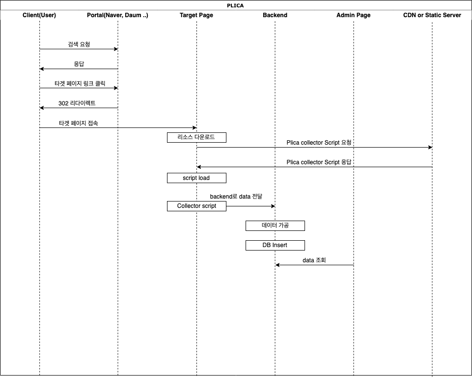

## PLICA

Plica is a PowerLink Connection Analysis System.

파워링크를 통하거나 직접 타겟 사이트에 접근할 시 클라이언트의 접속경로 및 정보를 수집하여 페이지 어드민에게 제공

#### 기한

미정😀, ~2/28 목표

#### 수집 데이터

페이지 어드민에게 최소한의 운영 Insight를 주기 위한 데이터들을 수집함

* Required Data
  * 동일 IP 접속 횟수
    * Client IP (or NAT IP)
    * User-Agent
  * 페이지 접속 경로
    * 직접 접속 or 파워링크
  * 파워링크를 통한 접속시 정보
    * 검색 키워드
    * 포털 종류
* Optional Data
  * 유저 페이지 체류 시간

#### 수집 방안

타겟 사이트에 자바스크립트를 삽입해 해당 스크립트에서 Backend로 수집한 데이터 전달

Backend에서 데이터 가공 및 DB Insert해 어드민 페이지에 데이터 제공

### 구현

#### PLICA Collector

* javascript 비컨
* shuttle.js 간단하게 구현해놓음

